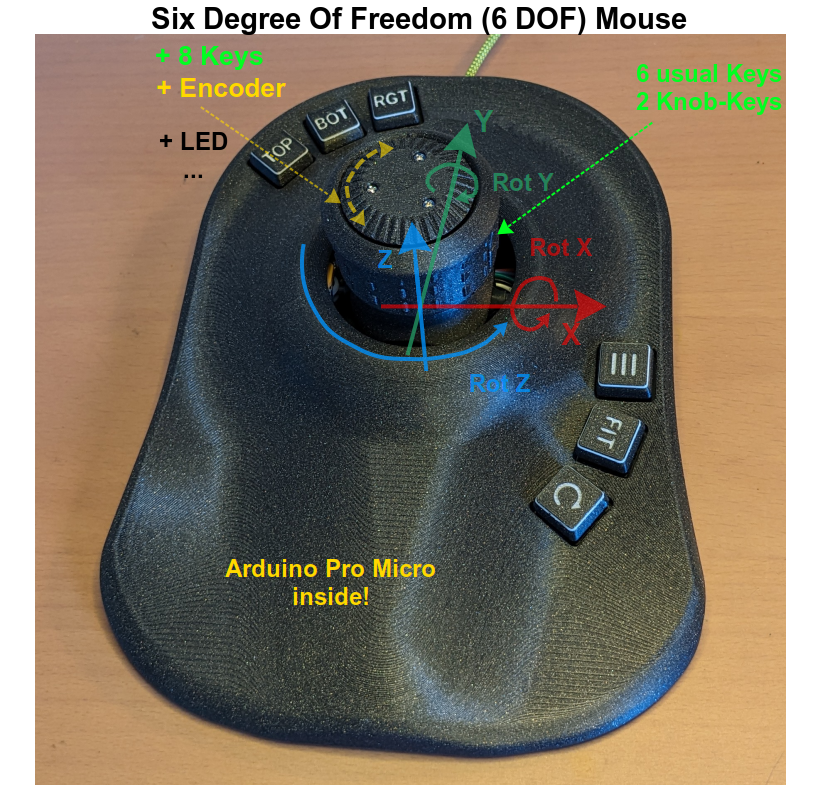
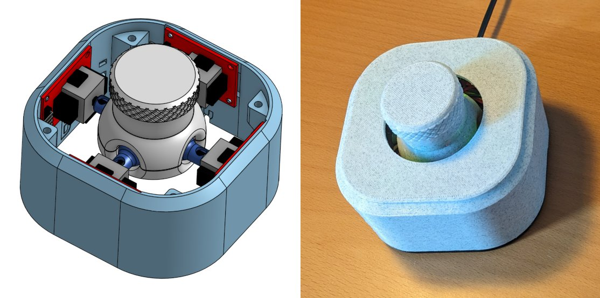
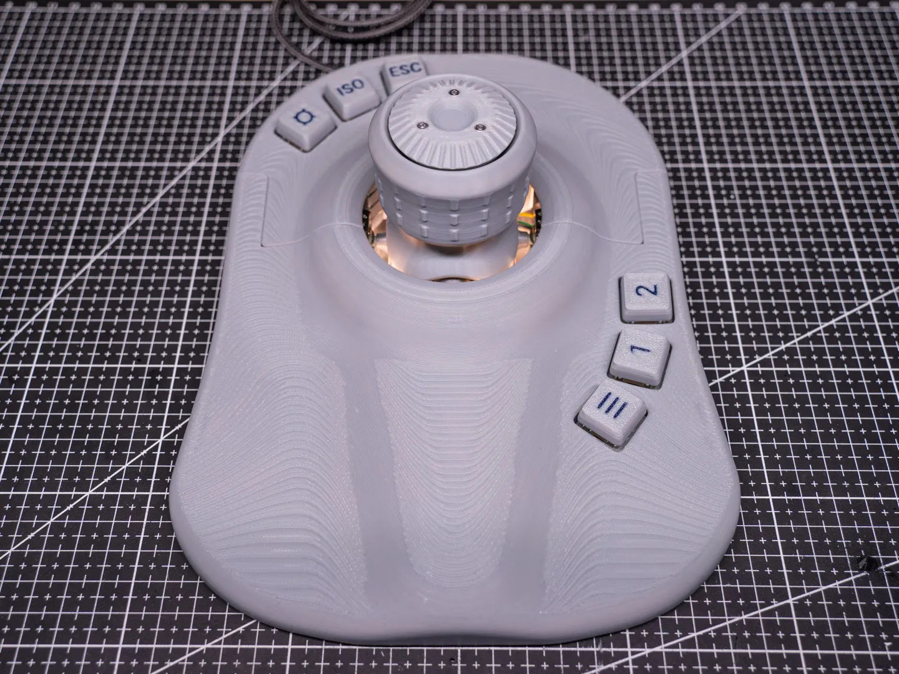
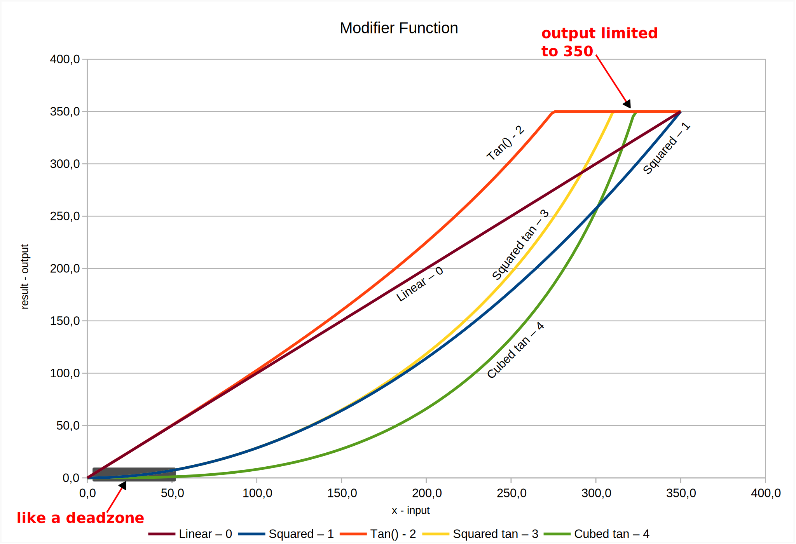

# Newest Stable Release
Check-out the [Release Page](https://github.com/AndunHH/spacemouse/releases) for the newest releases and updates!

- 0.8: Proper USB Interface with LED control
- 0.9: Exclusive mode and [LED ring support](#neopixel-led-ring)
- April 2025: [Version 1.0](https://github.com/AndunHH/spacemouse/releases/tag/v1.0.0): [Rotary encoder triggers keys](#rotary-keys)

# Ongoing work on the master-branch
## Hall effect sensors + Springs
@JarnoBoks merged the source code by @ChromeBee [space mouse with linear hall effect sensors](https://www.printables.com/model/940040-cad-mouse-spacemouse-using-hall-effect-sensors) resp. [the github repo](https://github.com/ChromeBee/Hall-Effect-Sensor-CAD-Mouse-Spacemouse) with this repository to integrate the hall effect sensor space mouse approach. 

In this mouse the joysticks are replaced by springs, magnets and linear hall effect sensors to avoid the mechanical limits of the joystick approach.

To read the eight linear hall effect sensors instead of the joysticks, use the `HALLEFFECT` definition in the config.h. @JarnoBoks provided a complete example: [config_sample_hall_effect.h](spacemouse-keys/config_sample_hall_effect.h) and proceed with the calibration as described in the config file.

# Open Source six degree of freedom (6 DOF) mouse with keys, encoder and more
Repository for a 3D mouse, which emulates a 3Dconnexion "Space Mouse Pro wireless". 
(This repository is NOT affiliated with 3Dconnexion. We just reverse-engineered the USB protocol.)



It is based on four joysticks with additional keys OR an encoder or on springs and linear hall effect sensors, as seen here by [John Crombies space mouse with linear hall effect sensors](https://www.printables.com/model/940040-cad-mouse-spacemouse-using-hall-effect-sensors)



To see many features in place, like the buttons and the encoder, check out the different versions by Jose L. González, like the 
 [ErgonoMouse MK XX - 6DOF Controller Knob & Joystick with Wheel, Buttons & Keys](https://www.printables.com/de/model/973725-ergonomouse-mk-xx-free-version-6dof-controller-kno): 



## Features of the 6 DOF mouse

### General Features

- Source code for an Arduino Pro Micro
- Read eight analog inputs and calculate the kinematics (either based on four joysticks or eight linear hall effect sensors)
- Emulation of the USB identification and the HID interface to behave like an original space mouse
- Advanced USB settings for linux users: Implemented jiggling or declaring the HID reports as relative or absolute values
- Semi-Automatic calibration methods to find the correct pin outs and measurement ranges
- Debug outputs can be requested over the serial interface during run time, see [config_sample.h](spacemouse-keys/config_sample.h#L36) 
- [Exclusive-Mode](#exclusive-mode): Transmit either translation or rotation and set the other one to zero, depending on what the main motion is.

### Buttons 
- Over ten keys may be reported to the PC via USB and may be evaluated by the original driver software
- Kill-Keys: Press one of two buttons to disable translation or rotation directly in the mouse and transmit just the other one.

### Encoder / Wheel
- An encoder wheel can be used to replace one axis and allow e.g. zooming
- Check out the [config_sample.h](spacemouse-keys/config_sample.h) for more information about configurable elements and extensive debug outputs
- The encoder can simulate consecutively pressed buttons (e.g. volume +), see [Rotary Keys](#rotary-keys)

### LEDs

- LED can be enabled by the PC driver
- Support for a [LED ring](#neopixel-led-ring), as supported by the FastLED library. E.g. a neopixel

### Wanted features, not jet there:
- Reverse Direction and Speed options in 3dConnexion Software is not working, because our spacemouse is not accepting this settings.
- Saving settings in the eeprom (instead of compiling newly found parameters).

Purchasing the [electronics](#electronics) and [printing some parts](#printed-parts) is not scope of this repository. We start with the software. Feel free to read some build reports:
- In the Wiki: [Building an Ergonomouse](https://github.com/AndunHH/spacemouse/wiki/Ergonomouse-Build) based on four joysticks
 
## Macro-Pad for CAD users
The original 3Dconnexion windows driver is very elegant to detect which program you are running and offering custom actions for the keys on a space mouse. You can utilize this behavior and build a space mouse with keys, just without the central part, the space mouse itself. You are left with keys, that you can assign to actions for your CAD program. This comes handy, if your original spacemouse doesn't have enough keys. In this case your PC will see an additional mouse where only the keystrokes are send and evaluated.

# Getting Started with PlatformIO
You can use PlatformIO to flash the board with this fast steps.
PlatformIO is easier than ArduinoIDE, because you don't need to change the board.txt files there.

1. Install [PlatformIO](https://platformio.org/).
2. [Download or clone this github repository](#cloning-the-github-repo) (hint for windows: network locations are not recommended)
3. Copy and rename `spacemouse-keys/config_sample.h` to `spacemouse-keys/config.h` and change the values to whatever suits.
4. Open PlatformIO / vscode and open the newly created folder.
5. Click on the upload arrow in the IDE in the status bar or run `pio run -t upload`.
6. [Assign the pins of the joysticks and go through the calibration](#calibrate-your-hardware)
6. [Use your space mouse](#use-the-6-dof-mouse)
8. Done!

# Getting Started with Arduino IDE 
1. [Create a custom board](#custom-board-to-emulate-the-space-mouse) in your Arduino IDE, that emulates the original space mouse
2. [Download or clone this github repository](#cloning-the-github-repo)
3. [Rename the config_sample.h to config.h](#create-your-own-config-file)
4. [Try to compile and flash your board](#compiling-and-flashing-the-firmware)
5. [Assign the pins of the joysticks and go through the calibration](#calibrate-your-hardware)
6. [Use your space mouse](#use-the-6-dof-mouse)
7. Done!
   
## Custom board to emulate the space mouse
The boards.txt file needs an additional board definition, which tells the microprocessor to report the USB identifiers correctly and emulate the 3dconnexion space-mouse. Please follow the detailed instructions on the [wiki page about custom board definition](https://github.com/AndunHH/spacemouse/wiki/Creating-a-custom-board-for-Arduino-IDE). 

## Cloning the github repo
Clone the github repo to your computer: Scroll-Up to the green "<> Code" Button and select, if you wish to clone or just download the code.

## Create your own config file
Copy the config_sample.h and rename it to config.h.
This is done to avoid the personal config file being overwritten when pulling new updates from this repository. You probably have to update the config.h file with new additions from the config_sample.h, but your pin assignment will not stay.

## Compiling and flashing the firmware
- Open the Arduino IDE (1.8.19 and 2.3.2 are tested on Ubuntu).
- Open spacemouse-keys.ino
- Select Tools -> Board -> SparkFun AVR Boards -> Spacemouse.
- (If you followed another boards.txt instructions, which also allow 3.3V with 8 Mhz: Make sure to select the proper processor: 5V 16MHz)
- Select the correct port (see troubleshooting section, which might be necessary for first upload)
- Compile the firmware

### Troubleshooting uploading
Troubleshooting for uploading is explained in detail here: 

[Uploading firmware to the Pro Micro](https://github.com/AndunHH/spacemouse/wiki/Uploading-firmware-to-the-Pro-Micro)


# Calibrate your hardware
After compiling and uploading the program to your hardware, you can connect via the serial monitor. In the upper line, you can send the desired debug mode to the board and observe the output. "-1" stops the debug output.

Read and follow the instructions throughout the config.h file and write down your results. Recompile after every step.

This calibration is supported by various debug outputs which can toggle on or off before compiling or during run time by sending the corresponding number via the serial interface.
All debug outputs are described at the top of your config_sample.h.

1. Check and correct your pin out -> Refer to the pictures in the [Electronics](#electronics) section below.
2. Tune dead zone to avoid jittering
3. Getting min and max values for your joysticks
	- There is a semi-automatic approach, which returns you the minimum and maximum values seen within 15s.
4. Adjust sensitivity
5. Choose modifier function:

Choose a modifier function with the help of the following picture. Note, that the Squared, Squared Tan and Cubed Tan function act like a dead one filter, because small inputs are resulting in nearly zero output, which may reduce unwanted movements. 
Also note, that some of those functions are already at their maximum output (and therefore limited), before the input reaches 350.




# Use the 6 DOF mouse
## Download the 3dconnexion driver on windows and mac
Download and install the [3DConnexion software](https://3dconnexion.com/us/drivers-application/3dxware-10/)

If all goes well, the 3DConnexion software will show a SpaceMouse Pro wireless when the Arduino is connected.

## spacenav for linux users
Checkout https://wiki.freecad.org/3Dconnexion_input_devices and https://github.com/FreeSpacenav/spacenavd.

Onshape is not jet supported by spacenav directly but there is a simple wrapper here: https://github.com/mamatt/space2onshape 

# Software Main Idea
1. The software reads the eight ADC values
2. During start-up the zero-position of the space mouse is measured and subtracted from the adc-value. -> The values now range from e.g. -500 to +500
3. A dead zone in the middle is applied to avoid small noisy movements. (E.g. every value between +/- 3 is fixed to zero)
4. The movement of the joysticks is mapped from the original about ca. +/- 500 digits to exactly +/- 350. (Therefore the real min and max values will be calibrated) Now all further calculations can be done with this normalized values between +/-350.
5. We calculate the translation and rotation based on this.
6. Applying the modifiers to minimize very small rotations or translations.
7. Kill, swap or invert movements
8. Sending the velocities and keys to the PC, see also  [SpaceNavigator.md](SpaceNavigator.md) for further details about the emulated USB HID.

# Printed parts
There are many parts and remixes available. A very good starting point is the Part [Open source SpaceMouse - Space Mushroom remix](https://www.printables.com/de/model/864950-open-source-spacemouse-space-mushroom-remix) by Teaching Tech. Check out the many remixes, especially if you want to use other joysticks modules!

Here are some of the remixes or additions that may be used with this software:

* [ErgonoMouse MK XX - 6DOF Controller Knob & Joystick with Wheel, Buttons & Keys](https://www.printables.com/de/model/973725-ergonomouse-mk-xx-free-version-6dof-controller-kno) by Jose L. González (Free and premium version available)
* [Lid with mounting for 4 MX Switch adapter](https://www.printables.com/de/model/883967-tt-spacemouse-v2-lid-with-mounting-for-4-mx-switch) by LivingTheDream
* [SpaceMouse Mini - Slim profile, with easier assembly and various improvements - v3](https://www.printables.com/de/model/908684-spacemouse-mini-slim-profile-with-easier-assembly) by Doug Joseph
* [Hall Effect Joysticks For the Space Mouse](https://www.printables.com/de/model/918029-hall-effect-joysticks-for-the-space-mouse) by Kempy
* [CAD mouse / Spacemouse using Hall Effect Sensors](https://www.printables.com/model/940040-cad-mouse-spacemouse-using-hall-effect-sensors) by JohnCrombie
* [Hall-Effect-Sensor-CAD-Mouse-Spacemouse](https://github.com/ChromeBee/Hall-Effect-Sensor-CAD-Mouse-Spacemouse/tree/main) with TPU springs by JohnCrombie.


# Electronics and pin assignment

The spacemouse is connected to an arduino Pro Micro 16 Mhz. Check out the wiring diagram by [TeachingTech](https://www.printables.com/de/model/864950-open-source-spacemouse-space-mushroom-remix/) or with this added keys and the added neopixel ring.


The calculations in the program expect AX to be the vertical joystick in front of you and AY the horizontal in front of you. B, C and D are clockwise around the spacemouse.
Maybe your joystick axis are named X and Y in an other orientation. That doesn't matter. Connect them and use the config.h file to put the pin the vertical joystick in front of you (=AX) to the first position. In teaching techs example, this is A1, even though his joystick is labeled "y". See also the [wiki](https://github.com/AndunHH/spacemouse/wiki/Ergonomouse-Build#calibration) for some additional pictures.


The calculation in this program results in X, Y and Z calculated as shown in the middle of the picture.
If this doesn't suit your program change it by using the INVX or SWITCHYZ afterwards.

## Kinematics
With the axis defined as shown in the picture above, the calculations for translation and rotation are as follows:
```
TRANSX = -CY + AY
TRANSY = -BY + DY
TRANSZ = -AX - BX - CX - DX
ROTX = -CX + AX
ROTY = -BX + DX
ROTZ = AY + BY + CY + DY
```
# Specific features
This section gives a deeper look into features that came into the mouse during time with the releases. 

## Neopixel led ring

December 2024 Update: Support for LED rings like a neopixel! 


The adafruit neopixel led ring with an inner diameter of 52.3 mm fits well.

Filming the LEDs "in action" is very hard, maybe you can get an idea:


## Exclusive Mode


When the exclusive mode is activated in the config.h only the major movement is transmitted. 
That means, that the mouse detects, if you want to translate or rotate.

When the biggest input is a translation: All rotations are set to zero.

When the biggest input is a rotation: All translations are set to zero.

This function is the sister of the kill-key feature, where you press a key to decide wether only translations or rotations are transmitted.

Thanks to @mamatt in #73 for this suggestion which were released in Version 0.9.

## Rotary Keys

When you are using the mouse with an encoder wheel, there is a new feature: Rotary Keys. 

When you enable this feature in the config, see _ROTARY_KEYS_, the encoder is not treated as an axis or movement but repeatedly triggers a button. This can be done to e.g. hit the volume+ button while turning the wheel clockwise.

Note: We are still using the emulated USB HID protocoll for the CAD mouse. Therefore, you need to define the pressed button in the config.h and than configure some actions on your PC driver. We are not emulating a standard keyboard. 

See [#68](https://github.com/AndunHH/spacemouse/issues/68) for more details.

# See also

Here are some other projects with regard to space mice. The arrow indicates what is emulated. 

* [This repository itself](https://github.com/AndunHH/spacemouse) -> space mouse
* [DIY SpaceMouse Profiles](https://github.com/raulpetru/DIY_SpaceMouse_Profiles) -> User interface to tune e.g. sensitivity of the mouse
* [A 6 degrees of freedom mouse for CAD programs using cheap linear Hall Effect sensors for position measurement](https://github.com/ChromeBee/Hall-Effect-Sensor-CAD-Mouse-Spacemouse) -> space mouse
* [DIY Spacemouse for Fusion 360](https://github.com/sb-ocr/diy-spacemouse) -> Mouse and Keyboard
* [Space Fox](https://github.com/pepijndevos/spacefox) -> Joystick based on potentiometers
* [Orbion The OpenSource 3D Space Mouse](https://github.com/FaqT0tum/Orbion_3D_Space_Mouse) -> Mouse and Keyboard
* [Space mouse with linear hall effect sensors](https://www.printables.com/model/940040-cad-mouse-spacemouse-using-hall-effect-sensors) resp. [the github repo](https://github.com/ChromeBee/Hall-Effect-Sensor-CAD-Mouse-Spacemouse) -> space mouse with hall effect sensors

# License
Because TeachingTech published his source code on Printables under this license, it also applies here:

[![CC BY-NC-SA 4.0][cc-by-nc-sa-shield]][cc-by-nc-sa]

This work is licensed under a
[Creative Commons Attribution-NonCommercial-ShareAlike 4.0 International License][cc-by-nc-sa].

[![CC BY-NC-SA 4.0][cc-by-nc-sa-image]][cc-by-nc-sa]

[cc-by-nc-sa]: http://creativecommons.org/licenses/by-nc-sa/4.0/
[cc-by-nc-sa-image]: https://licensebuttons.net/l/by-nc-sa/4.0/88x31.png
[cc-by-nc-sa-shield]: https://img.shields.io/badge/License-CC%20BY--NC--SA%204.0-lightgrey.svg


# History
This code is the combination of multiple works by others. This list summarizes what happened before this github repository was started:
1. Original code for the Space Mushroom by Shiura on Thingiverse: https://www.thingiverse.com/thing:5739462
2. The next two from the comments on the instructables page: https://www.instructables.com/Space-Mushroom-Full-6-DOFs-Controller-for-CAD-Appl/
3. and the comments of Thingiverse: https://www.thingiverse.com/thing:5739462/comments
4. Code to emulate a 3DConnexion Space Mouse by jfedor: https://pastebin.com/gQxUrScV
5. This code was then remixed by BennyBWalker to include the above two sketches: https://pastebin.com/erhTgRBH
6. Four joystick remix code by fdmakara: https://www.thingiverse.com/thing:5817728
7. [Teaching Techs work](https://www.printables.com/de/model/864950-open-source-spacemouse-space-mushroom-remix) involves mixing all of these: 
The basis is fdmakara four joystick movement logic, with jfedor / BennyBWalker's HID SpaceMouse emulation. The four joystick logic sketch was setup for the joystick library instead of HID, so elements of this were omitted where not needed. The outputs were jumbled no matter how TeachingTech plugged them in, so TeachingTech spent a lot of time adding debugging code to track exactly what was happening. On top of this, TeachingTech has added more control of speed / direction and comments / links to informative resources to try and explain what is happening in each phase.
8. Code to include measured min and max values for each Joystick by Daniel_1284580 (In Software Version V1 and newer)
9. Improved code to make it more user friendly by Daniel_1284580 (In Software Version V2 and newer)
10. Improved Code, improved comments and added written tutorials in comments, by [LivingTheDream](https://www.printables.com/de/model/883967-tt-spacemouse-v2-lid-with-mounting-for-4-mx-switch/files) Implemented new algorithm "modifier function" for better motion control by Daniel_1284580 (In Software Version V3)
11. Moved the dead zone detection into the initial ADC conversion and calculate every value every time and use the modifier for better separation between the access, By Andun_HH.
12. Added two additional buttons integrated into the knob to kill either translation or rotation at will and prevent unintended movements, by JoseLuisGZA and AndunHH.
13. Added Encoder to use with a wheel on top of the main knob an simulate pulls on any of the axis (main use is simulating zoom like the mouse wheel), by [JoseLuizGZA](https://github.com/JoseLuisGZA/ErgonoMouse/) and rewritten by AndunHH.

Please check the [release history](https://github.com/AndunHH/spacemouse/releases) for more recent history...