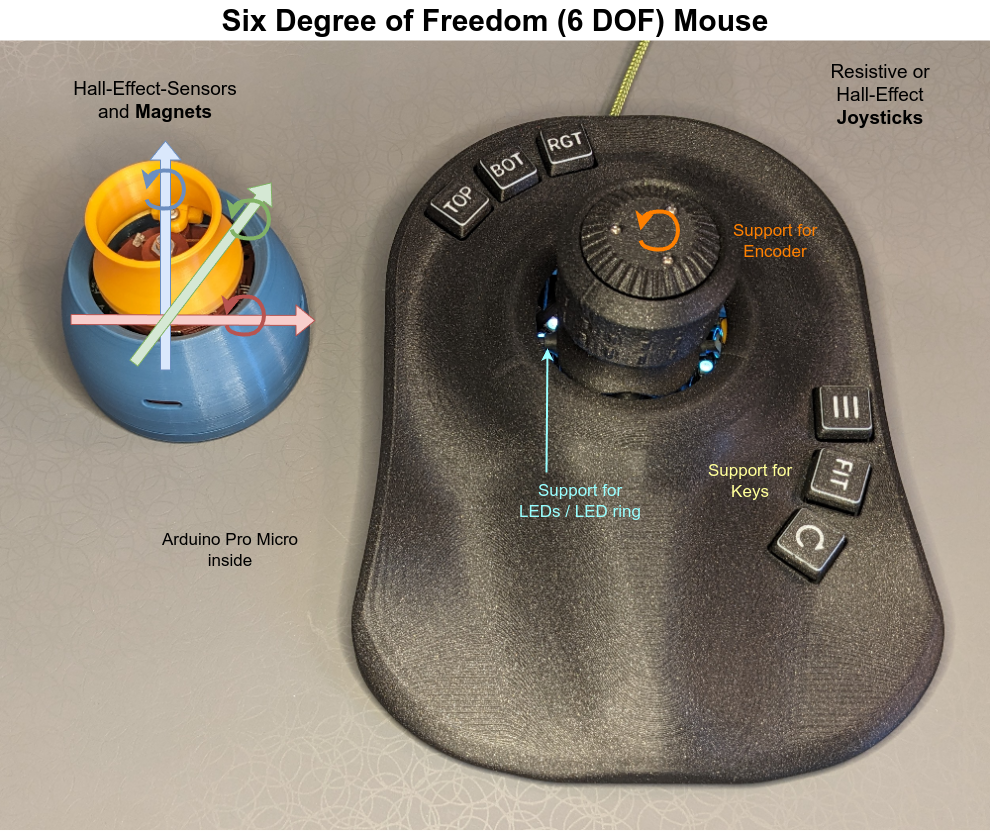

# Open Source six degree of freedom (6 DOF) mouse with keys, encoder and more
Repository for a 3D mouse, which emulates a 3Dconnexion "Space Mouse Pro wireless". 

This repository is NOT affiliated with 3Dconnexion. We just reverse-engineered the USB protocol.



# Newest Stable Release
<!-- This release list should hold the latest three releases. The new feature descriptions are placed up here. When the release is not so new anymore, the paragraphs with the feature should be moved down to the other features. -->

Check-out the [Release Page](https://github.com/AndunHH/spacemouse/releases) for the newest releases and updates!

- [Version 3.0](https://github.com/AndunHH/spacemouse/releases/tag/v3.0.0): 
  - [Shortened config parameters](#shortened-config-parameters) reducing program size
  - [ProgMode](#progmode) allows setting parameters remotely over a defined language.
  - Check the release page [3.0](https://github.com/AndunHH/spacemouse/releases/tag/v3.0.0), because this major release needs a slight adjustment of your config file!
  - inserted a hysteresis into the exclusive mode to prevent immediate switching back and forth between Trans- and Rot-mod: `EXCL_HYST`, see [Exclusive Mode](#exclusive-mode).
- [Version 2.1](https://github.com/AndunHH/spacemouse/releases/tag/v2.1.2): 
  - The [modifier function](#modifier-function) has a html page, where you can visualize the effect of the chosen parameters.
  - Changing **Sensitivity and Direction on Windows** in the 3Dx Settings works. Update to `3DxWare: 10.9.7.709, 3DxWinCore: 17.9.7.21845`. Tested on Win 11 24H2.
  - Added [testConfigCompileSize.py](testConfigCompileSize.py) to calculate the required program size for different configurations. The results can be seen here: [Build report](testConfig/0_build_report.md). There is no continuous integration jet. This page must be created manually.
- [Version 2.0](https://github.com/AndunHH/spacemouse/releases/tag/v2.0.0): Serial Menu, Store parameters in EEPROM, new modifierFunction and Drift-compensation
  - Generally enhanced [serial menu](#serial-interface-menu) for debug outputs
  - Changing and evaluation of parameters without recompiling and download: editing and handling the parameters on the controller via the serial (debug-)connection
  - Save those parameters permanently into the [EEPROM](#storing-parameters-in-the-eeprom) or print them for the config.h
  - Enhancements on exclusive-mode for resistive joysticks, like [prio-z-exclusive mode](#prio-z-exclusive)
  - [Drift-compensation for hall-joysticks](#drift-compensation-for-hall-joysticks) to stop movements when not touched
  - New [modifier function](#modifier-function) to have better control over the form of the curve
  - CalcMinMax: no need to reset/reboot after use, you can now rerun it without reboot


## Upcoming Work
For the next release, already to be found in master:
- Python API to interact witht he progMode. Check out [SpaceMouseAPI.py](progModePy/SpaceMouseAPI.py)

## Shortened config parameters
To reduce the program size, the parameters in the config.h have been shortened. Therefore your old config.h will not work out of the box, but you need to rename the parameters. As a conversion is necessary, this is named release version 3.

As this may be annoying, this is supported by this script: [ParameterRenamingV3.py](ParameterRenamingV3.py)

# Complete description of the project 

This repository contains the software for a 3D mouse with six degrees of freedom (6 DOF), which emulates a 3Dconnexion "Space Mouse Pro wireless". 

This repository is NOT affiliated with 3Dconnexion. We just reverse-engineered the USB protocol.


The software in this repo supports two different hardware variants:
1. The usage of **joysticks** (either resistive joysticks or hall-effect joysticks)
2. The usage of four **hall-effect sensors** which directly measure the distance two **four magnets**.


The joysticks version gained popularity through this [TeachingTech YouTube Video](https://www.youtube.com/watch?v=2xAk-wegS9o). To see many features in place, like the buttons and the encoder with joysticks, check out the different versions by Jose L. González, like the 
 [ErgonoMouse MK XX - 6DOF Controller Knob & Joystick with Wheel, Buttons & Keys](https://www.printables.com/de/model/973725-ergonomouse-mk-xx-free-version-6dof-controller-kno)

The Hall-Effect-Sensor + Magnet version is greatly described here by [John Crombies space mouse with linear hall effect sensors](https://www.printables.com/model/940040-cad-mouse-spacemouse-using-hall-effect-sensors) and improved with [TPU springs](https://www.printables.com/model/1087923-hall-effect-spacemouse-cad-mouse-with-tpu-springs).

Other implementations, hardware or mechanic variants are linked below.

## Features of this software for the 6 DOF mouse

### General Features

- Source code for an Arduino Pro Micro
- Read eight analog inputs and calculate the kinematics (either based on four joysticks or eight linear hall effect sensors) with advanced [modifier function](#modifier-function).
- Emulation of the USB identification and the HID interface to behave like an original space mouse
- Advanced USB settings for linux users: Implemented jiggling or declaring the HID reports as relative or absolute values, see [spacenav](#spacenav-for-linux-users)
- Semi-Automatic calibration methods to find the correct pin outs and measurement ranges
- Debug outputs can be requested over the serial interface from a [menu](#serial-interface-menu) for debug outputs
- Changing and evaluation of parameters without recompiling and download: editing and handling the parameters on the controller via the serial (debug-)connection
- Save those parameters permanently into the [EEPROM](#storing-parameters-in-the-eeprom) or print them for the config.h
- [Exclusive-Mode](#exclusive-mode): Transmit either translation or rotation and set the other one to zero, depending on what the main motion is.- 
- [Drift-compensation for hall-joysticks](#drift-compensation-for-hall-joysticks) to stop movements when not touched

### Buttons 
- Over ten keys may be reported to the PC via USB and may be evaluated by the original driver software
- Kill-Keys: Press one of two buttons to disable translation or rotation directly in the mouse and transmit just the other one.

### Encoder / Wheel
- An encoder wheel can be used to replace one axis and allow e.g. zooming
- Check out the [config_sample.h](spacemouse-keys/config_sample.h) for more information about configurable elements and extensive debug outputs
- The encoder can simulate consecutively pressed buttons (e.g. volume +), see [Rotary Keys](#rotary-keys)

### LEDs

- LED can be enabled by the PC driver
- Support for a [LED ring](#neopixel-led-ring), as supported by the FastLED library. E.g. a neopixel

### Wanted features, not jet there:
- With all features enabled, the pro micro is nearly at the limits of it's flash. Reducing the flash size might be necessary in the future...
- The html page explaining the modifier function would benefit from an additional plot zooming in on zero.

Purchasing the [electronics](#electronics-and-pin-assignment-with-joysticks) and [printing some parts](#printed-parts-and-hardware) is not scope of this repository. We start with the software. Feel free to read some build reports:
- In the Wiki: [Building an Ergonomouse](https://github.com/AndunHH/spacemouse/wiki/Ergonomouse-Build) based on four joysticks
 
## Macro-Pad for CAD users
The original 3Dconnexion windows driver is very elegant to detect which program you are running and offering custom actions for the keys on a space mouse. You can utilize this behavior and build a space mouse with keys, just without the central part, the space mouse itself. You are left with keys, that you can assign to actions for your CAD program. This comes handy, if your original spacemouse doesn't have enough keys. In this case your PC will see an additional mouse where only the keystrokes are send and evaluated.

# Getting Started with PlatformIO
You can use PlatformIO to flash the board with this fast steps.
PlatformIO is easier than ArduinoIDE, because you don't need to change the board.txt files there.

1. Install [PlatformIO](https://platformio.org/).
2. [Download or clone this github repository](#cloning-the-github-repo) (hint for windows: network locations are not recommended)
3. [Rename the config_sample.h to config.h](#create-your-own-config-file)
4. Open PlatformIO / vscode and open the newly created folder.
5. Click on the upload arrow in the IDE in the status bar or run `pio run -t upload`.
6. [Assign the pins of the joysticks and go through the calibration](#calibrate-your-hardware)
6. [Use your space mouse](#use-the-6-dof-mouse)
8. Done!

# Getting Started with Arduino IDE 
1. [Create a custom board](#custom-board-to-emulate-the-space-mouse) in your Arduino IDE, that emulates the original space mouse
2. [Download or clone this github repository](#cloning-the-github-repo)
3. [Rename the config_sample.h to config.h](#create-your-own-config-file)
4. [Try to compile and flash your board](#compiling-and-flashing-the-firmware)
5. [Assign the pins of the joysticks and go through the calibration](#calibrate-your-hardware)
6. [Use your space mouse](#use-the-6-dof-mouse)
7. Done!
   
## Custom board to emulate the space mouse
The boards.txt file needs an additional board definition, which tells the microprocessor to report the USB identifiers correctly and emulate the 3dconnexion space-mouse. Please follow the detailed instructions on the [wiki page about custom board definition](https://github.com/AndunHH/spacemouse/wiki/Creating-a-custom-board-for-Arduino-IDE). 

## Cloning the github repo
Clone the github repo to your computer: Scroll-Up to the green "<> Code" Button and select, if you wish to clone or just download the code.

## Create your own config file
Copy and rename [config_sample.h](spacemouse-keys/config_sample.h) to `spacemouse-keys/config.h` and change the values to whatever suits.
If your are using a Hall-Effect-Sensor+Magnet approach start with [config_sample_hall_effect.h](spacemouse-keys/config_sample_hall_effect.h)

This is done to avoid the personal config file being overwritten when pulling new updates from this repository. 

## Compiling and flashing the firmware
- Open the Arduino IDE (1.8.19 and 2.3.2 are tested on Ubuntu).
- Open spacemouse-keys.ino
- Select Tools -> Board -> SparkFun AVR Boards -> Spacemouse.
- (If you followed another boards.txt instructions, which also allow 3.3V with 8 Mhz: Make sure to select the proper processor: 5V 16MHz)
- Select the correct port (see troubleshooting section, which might be necessary for first upload)
- Compile the firmware

### Troubleshooting uploading
Troubleshooting for uploading is explained in detail here: 

[Uploading firmware to the Pro Micro](https://github.com/AndunHH/spacemouse/wiki/Uploading-firmware-to-the-Pro-Micro)


# Calibrate your hardware
After compiling and uploading the program to your hardware, you can connect via the serial monitor. Hit enter and use the [serial menu](#serial-interface-menu) to select the proper debug outputs. Make sure that your Line Ending is set to "CRLF" in PlatformIO / "Both NL & CR" in Arduino IDE (if this is not set, the command will timeout after 30s and present you the menu again).

Read and follow the instructions throughout the config.h file and write down your results. The initial parameters are hardware dependent and you need to recompile for the changes to take effect. The later parameters for sensitivities can be tuned via the menu and saved to the [EEPROM](#storing-parameters-in-the-eeprom) (and exported back to config.h)

This calibration is supported by various debug outputs. All debug outputs are described at the top of your config_sample.h.

1. Check and correct your pin out -> Refer to the pictures in the [Electronics](#electronics-and-pin-assignment-with-joysticks) section below.
2. Tune dead zone to avoid jittering
3. Getting min and max values for your joysticks
	- There is a semi-automatic approach, which returns you the minimum and maximum values seen within 15s.
4. Adjust sensitivity
5. Choose modifier function:

## Modifier Function
Choose a modifier function to change the linear relationship between raw and processed data. 

Note, that the Squared Tan function act like a dead zone filter, because small inputs are resulting in a small output, which may reduce unwanted movements. 


The modifier function can also be parametrized with the parameters a (= slope_at_zero) and b (= slope_at_end). 
 
The squared function (modFunc = 1):
$$y = x^a  \cdot sign(x)$$

For example, the squared tangens function (modFunc = 3):
$$y = \frac {tan(b \cdot (|x|^a \cdot sign(x)))}{tan(b)}$$

You can **interactively** change the parameters a and b [on this html page ](modifierFunctions.html) to show the impact of the parameters on the modifier functions.

If you read this page in github and the links brings to the raw html code, open the html file locally on your machine or [here on github pages](https://andunhh.github.io/spacemouse/modifierFunctions.html).

# Use the 6 DOF mouse
## Download the 3dconnexion driver on windows and mac
Download and install the [3DConnexion software](https://3dconnexion.com/us/drivers-application/3dxware-10/)

If all goes well, the 3DConnexion software will show a SpaceMouse Pro wireless when the Arduino is connected.

Changing sensitivity and direction on Windows in the 3Dx Settings works. Tested with `3DxWare: 10.9.7.709, 3DxWinCore: 17.9.7.21845`. Tested on Win 11 24H2.

## spacenav for linux users
Checkout https://wiki.freecad.org/3Dconnexion_input_devices and https://github.com/FreeSpacenav/spacenavd.

If you have problems with stuttering values, please check the advanced USB HID settings at the bottom of the config.h, especially the `ADV_HID_JIGGLE`.

Onshape is not jet supported by spacenav directly but there is a simple wrapper here: https://github.com/mamatt/space2onshape 

# Software Main Idea
1. The software reads the eight ADC values
2. During start-up the zero-position of the space mouse is measured and subtracted from the adc-value. -> The values now range from e.g. -500 to +500
3. A dead zone in the middle is applied to avoid small noisy movements. (E.g. every value between +/- 3 is fixed to zero)
4. The movement of the joysticks is mapped from the original about ca. +/- 500 digits to exactly +/- 350. (Therefore the real min and max values will be calibrated) Now all further calculations can be done with this normalized values between +/-350.
5. We calculate the translation and rotation based on this.
6. Applying the modifiers to minimize very small rotations or translations.
7. Kill, swap or invert movements
8. Sending the velocities and keys to the PC, see also  [SpaceNavigator.md](SpaceNavigator.md) and [SpaceMouseWireless.md](SpaceMouseWireless.md)for further details about the emulated USB HID.

# Printed parts and hardware
Here are some links for the joystick and the newer, more precise hall-effect + magnet variants (more sophisticated build and requires printing of TPU)

## Joystick 
* very good starting point is the Part [Open source SpaceMouse - Space Mushroom remix](https://www.printables.com/de/model/864950-open-source-spacemouse-space-mushroom-remix) by Teaching Tech. Check out the many remixes, especially if you want to use other joysticks modules!
* [ErgonoMouse MK XX - 6DOF Controller Knob & Joystick with Wheel, Buttons & Keys](https://www.printables.com/de/model/973725-ergonomouse-mk-xx-free-version-6dof-controller-kno) by Jose L. González (Free and premium version available)
* [Lid with mounting for 4 MX Switch adapter](https://www.printables.com/de/model/883967-tt-spacemouse-v2-lid-with-mounting-for-4-mx-switch) by LivingTheDream
* [SpaceMouse Mini - Slim profile, with easier assembly and various improvements - v3](https://www.printables.com/de/model/908684-spacemouse-mini-slim-profile-with-easier-assembly) by Doug Joseph
* [Hall Effect Joysticks For the Space Mouse](https://www.printables.com/de/model/918029-hall-effect-joysticks-for-the-space-mouse) by Kempy

## Hall-Effect Sensor + Magnets
* [CAD mouse / Spacemouse using Hall Effect Sensors](https://www.printables.com/model/940040-cad-mouse-spacemouse-using-hall-effect-sensors) by JohnCrombie
* [Hall-Effect-Sensor-CAD-Mouse-Spacemouse](https://github.com/ChromeBee/Hall-Effect-Sensor-CAD-Mouse-Spacemouse/tree/main) with TPU springs by JohnCrombie.


# Electronics and pin assignment with joysticks
  > The following paragraph relates to the joystick hardware variant. A thorough description of the principle behind the hall-effect sensors can be found down here [Hall Effect Sensors](#hall-effect-sensors) and on [ChromeBee GitHub: Hall-Effect-Sensor](https://github.com/ChromeBee/Hall-Effect-Sensor-CAD-Mouse-Spacemouse).

The spacemouse is connected to an arduino Pro Micro 16 Mhz. Check out the wiring diagram by [TeachingTech](https://www.printables.com/de/model/864950-open-source-spacemouse-space-mushroom-remix/) or with this added keys and the added neopixel ring.


Please be aware that only a limited amount of _ten_ (10!) digital inputs is available, that all optional features need to share. You'll need:
- two pins for the encoder
- one pin for a LED or the led ring
- one pin per key (i.e. only seven in total, if encoder and LED are used!)

The calculations in the program expect AX to be the vertical joystick in front of you and AY the horizontal in front of you. B, C and D are clockwise around the spacemouse.
Maybe your joystick axis are named X and Y in an other orientation. That doesn't matter. Connect them and use the config.h file to put the pin the vertical joystick in front of you (=AX) to the first position. In teaching techs example, this is A1, even though his joystick is labeled "y". See also the [wiki](https://github.com/AndunHH/spacemouse/wiki/Ergonomouse-Build#calibration) for some additional pictures.


The calculation in this program results in X, Y and Z calculated as shown in the middle of the picture.
If this doesn't suit your program change it by using the INVX or SWITCHYZ afterwards.

## Kinematics
With the axis defined as shown in the picture above, the calculations for translation and rotation are as follows:
```
TRANSX = -CY + AY
TRANSY = -BY + DY
TRANSZ = -AX - BX - CX - DX
ROTX = -CX + AX
ROTY = -BX + DX
ROTZ = AY + BY + CY + DY
```
# Specific features
This section gives a deeper look into features that came into the mouse during time with the releases. 

## Serial interface menu
The serial interface is showing a menu to list the possible options you may ask.

```
SpaceMouse FW2.x.y - Debug Modes
ESC stop running mode, leave menu (ESC, Q)
  1 raw joystick ADC values 0..1023
  2 centered values -500..+500
 11 auto calibrate centers, show deadzones
 20 find min/max-values over 15s (move stick)
  3 centered values w.deadzones -350..+350
  4 velocity- (trans-/rot-)values -350..+350
  5 centered- & velocity-values, (3) and (4)
  6 velocity after kill-keys and keys
 61 velocity after axis-switch, exclusive
  7 loop-frequency-test
  8 key-test, button-codes to send
  9 encoder wheel-test
 30 parameters (read, write, edit, view)
```
### Usage of serial interface menu

- all inputs are done by typing a number and press 'enter'. To input floating point-values - and . are allowed.
- to abort a numerical input, press 'esc', 'q' or another non-numerical char
- to select a menu / debug-mode, input its number
- to leave a running debug-mode press 'space', 'esc' or 'q'
- the active menu-level is shown by its prompt, example "mode::"
- to leave a menu-level press 'space', 'esc' or 'q'
- a typed in value will be shown AFTER 'enter' is pressed

## Storing parameters in the EEPROM
The parameters from the config.h file are initially read and stored in the eeprom of the controller. Despite the hardware related constant definitions, you can edit all the sensitivities on the fly over the menu item 30:
```
SpaceMouse FW2.x.y - Parameters
ESC leave parameter-menu (ESC, Q)
  1  list parameters
  2  edit parameters
  3  read from EEPROM
  4  write to EEPROM
  5  clear EEPROM to 0xFF
  6  set EEPROM params invalid
  7  list parameters as defines
```

### Usage for parameter EEPROM

1. Initially the parameters hold the #defined values from config.h
2. with the new parameter-menu "edit parameters" you can edit them - they go to the struct par in RAM
3. you can test the modified parameters immediately without leaving the parameter-menu
4. 
    1. If you switch off/reset the SpaceMouse, the parameters are lost because they are only stored in RAM
    2. In the parameter-menu you can save the parameters to EEPROM on the Arduino, use menu "write to EEPROM" - from now this parameters survive restarts
5. as a backup you can list all parameters with then menu "list parameters as defines", you get a list of #defines that you can copy/paste from your terminal-program to a textfile (for storage/documentation) or into your config.h-file to set them as new initial values
5. on restart of the SpaceMouse the parameters will be automatically read from EEPROM if they are flagged as valid.     They are considered as valid if a correct magicNumber is stored in the EEPROM.
6. 
    1. if the parameters are destroyed (why?) or the struct had changed (by modifying the program itself), you can invalidate the stored parameters via menu "set EEPROM params invalid" (kills the magicNumber)
    2. as an alternative you can erase the whole EEPROM with "clear EEPROM to 0xFF"
7. on the next restart the parameters are only filled with the #defined values from config.h

CAUTION: the EEPROM-chip on the Arduino is capable of 10.000 writes per storage-byte. By manually editing and storing the modified parameters we won't get in trouble - but frequent automated saving of parameters won't be a good idea, the EEPROM may get damaged. 

The parameters will be stored to the same location all the time - a load-leveling-algorithm would be too much code for too less benefit. The Arduino-function EEPROM.put() itself only writes bytes,
that really have changed - so only changed values wear out EEPROM-bytes, unchanged parts don't.

## ProgMode

The ProgMode and the parameter-menu can be used alternatively over the same serial interface.
The parameter menu has to be at the base level (debug) for the ProgMode to operate.
Because of the simple nature of the Serial-API and the restricted mem on the controller, the following basic interface is provided:

### ProgMode-Command
* a command is started by a '>'-character
* the command itself is one character long, e.g. 'w' for "write parameter"
* after the command may follow _one_ numerical value, e.g. the value to write
* the whole command ends with the CR-character

### Prog-Mode-Acknowledgement: 
Every command is parsed, checked and executed. After that an acknowledge is sent:
* the acknowledge begins with a '<' character
* then the command-char follows (to identify the acknowledge)
* depending on the command, a numerical cmd-result or the requested value is sent
* values range 0/1 for bool, -9999...+9999 for INT and xx.yyy as FLOAT results
* because an INT is defined up to 9999, possible result-codes starting from 10000 (result OK)

| acknowledges (PE=ProgmodeError) | Value | 
| ---   | --- |
|  PE_OK              |   10000 |
|  PE_INVALID_PARAM   |   10001 |
|  PE_INVALID_VALUE   |   10002 |
|  PE_VALUE_FAULT    |    10003 |
|  PE_CMD_FAULT      |    10004 |

### Command and Acknowledgement
Cmd    |function                     |returns (>= 10000 -> NOK) |
-------|-----------------------------|---------------------- |
| `>m`| get magic number             | `<m...   <magic number>` all values are valid, no fault-codes!|
| `>n`  | get number of parameters   | `<n...   (<number of params>)` |
| `>p...` | parameter number set     | `<p...   (PE_OK,PE_INVALID_PARAM)`|
| `>t`    | get type of parameter    | `<t...   (<type>: 1=bool,2=int,3=float or PE_INVALID_PARAM)`|
| `>d`    | get description of parameter  | `<d...   (<name of parameter> or PE_INVALID_PARAM)` |
| `>r`    | read value                    | `<r...   (<value> or PE_INVALID_PARAM`|
| `>w...` | write value                   | `<w...   (PE_OK,PE_INVALID_PARAM,PE_INVALID_VALUE "not in [-10000..+10000]")`|
| `>l`    | load params from EEPROM       | `<l10000 (PE_OK)`|
| `>s `   | save params to EEPROM         | `<s10000 (PE_OK)`|
| `>i `   | invalidate magic number       | `<i10000 (PE_OK)`|
| `>c `   | clear EEPROM                  | `<c10000 (PE_OK)`|

To work with a parameter, first you have to address the parameter with the `p`-command. The following commands that work on parameters use the address set by the last `p`-command.
### ProgMode example
```
    cmd:    ack:        description:
    >p3     <p10000     address parameter 3 -> result OK
    >t      <t1         get type of parameter -> type is 1=INT
    >r      <r42        read value -> parameter has value 42
```

### ProgMode Workflow
A suggested workflow would be:
```
  >m        if no acknowledge after 500ms, the SpaceMouse is not in base/debug-menu
            - we can try to send a 'q'-character followed by CR three times to get back in menu-system
              and send some (up to three) 'm'-commands afterwards to see, if we get in sync with the ProgMode
  >m        <m1964120905            magic number of EEPROM-data, identifies the data set-version
  now we are connected and know about the version.

  >n        <n33                    gets the number of parameters
  now we know about the number of parameters.

  get all parameters with name, type and value:
  >p1       <10000                  adress parm 1 (ack: OK)
  >d        <dDEADZONE              description=name of the parameter is "DEADZONE"
  >t        <t1                     parameter is of type 1 = INT
  >r        <r16                    parameter has the value 16

  >p2       <10000                  adress parm 2 (ack: OK)
  >d        <dTRANSX_SENSITIVITY    description=name of the parameter is "TRANSX_SENSITIVITY"
  >t        <t2                     parameter is of type 2 = FLOAT
  >r        <r2.500                 parameter has the value 2.5
  repeat up to param nr.33

  write a new value to a parameter on the device:
  >p16      <p10000                 adress param 16 (ack OK)
  >w1       <w10000                 value 1 written to the parameter 16 (ack OK)

  save all parameters to EEPROM as device bootup-configuration:
  >s        <s10000                 save parameters to EEPROM (ack OK)
```

With this workflow we are independent from the number and order of the parameters.  A simple list-style program would automatically grow, if the number of parameters grows.

on the base/debug-menu you can manually test the ProgMode by simply typing in the ProgCmds
  and you will see the acknowledges on your terminal.
  
  ATTENTION: the manually typed in commands are executed and do their work! A `>c` with CR will  really clear the EEPROM of the device!


## PRIO-Z-EXCLUSIVE
If prio-z-exclusive-mode is on, rotations are only calculated, if no z-move is detected.

This feature is recommended for resistive joysticks.

When pushing or pulling, the knob produced transient rotational components that stops when the z-translation gets the priority. So when pulling, we get first a rotation then the desired translation.

So this mode sees that min. 3 of 4 joysticks all move up (or down) and use it as an indicator that the knob is mainly pushed/pulled. So before any (ghost-)rotational component can be calculated, it is sorted out.

## Drift compensation for hall-joysticks

@StefanNouza implemented a drift-compensation to re-zero the (hall-)joysticks when the mouse is untouched. This is necessary because hall-joystick-readings don't show any deadzone, like resistive joysticks do.
  
He wanted use the small readings possible around zero to get a precise reaction to slight touches. This can be done by setting the DEADZONE to 0 and tune the modifierFunction to output values even at small joystick-readings. But then, it can be seen that the mechanics produce a new random zeropoint everytime the SpaceMouse is left untouched.

So this drift-compensation was invented to overcome the slightly unprecise mechanics.
The compensation finds out when the SpaceMouse is untouched. Then it sets the readings of the joysticks to 0.

This is implemented in the compensateDrifts() function in calibration.cpp. You can fine tune the drift compensation with those parameters. Check the config_sample.h for more infos.
| Parameter | Short description |
| --- | --- |
| COMP_ENABLED | enable the compensation |
| COMP_NO_OF_POINTS | number of points to build the mean-value |
| COMP_WAIT_TIME |  [ms] time to wait and monitor before compensating (smaller value=>faster re-centering, but may cut off small moves) | 
| COMP_MIN_MAX_DIFF |  [incr] maximum range of raw-values to be considered as only drift |
| COMP_CENTER_DIFF | [incr] maximum distance from the center-value to be only drift (never compensates above this offset) |

## Neopixel led ring

December 2024 Update: Support for LED rings like a neopixel! 


The adafruit neopixel led ring with an inner diameter of 52.3 mm fits well.

Filming the LEDs "in action" is very hard, maybe you can get an idea:


## Exclusive Mode
When the exclusive mode is activated in the config.h only the major movement is transmitted. 
That means, that the mouse detects, if you want to translate or rotate.

When the biggest input is a translation: All rotations are set to zero.

When the biggest input is a rotation: All translations are set to zero.

This function is the sister of the kill-key feature, where you press a key to decide wether only translations or rotations are transmitted.

[Thanks to @mamatt in #73 for this suggestion which were released in Version 0.9.]

Additionally a hysteresis is configurable into the exclusive mode to prevent immediate switching back and forth between Trans- and Rot-mode: `EXCL_HYST`. A value of 0 turns it off (old behavior). 

[Thanks to @StefanNouza in Version 3.0]

Check also the [prio-z-exclusive mode](#PRIO-Z-EXCLUSIVE).

## Rotary Keys

When you are using the mouse with an encoder wheel, there is a new feature: Rotary Keys. 

When you enable this feature in the config, see _ROTARY_KEYS_, the encoder is not treated as an axis or movement but repeatedly triggers a button. This can be done to e.g. hit the volume+ button while turning the wheel clockwise.

Note: We are still using the emulated USB HID protocoll for the CAD mouse. Therefore, you need to define the pressed button in the config.h and than configure some actions on your PC driver. We are not emulating a standard keyboard. 

See [#68](https://github.com/AndunHH/spacemouse/issues/68) for more details.

## Hall effect sensors
@JarnoBoks merged the source code by @ChromeBee [space mouse with linear hall effect sensors](https://www.printables.com/model/940040-cad-mouse-spacemouse-using-hall-effect-sensors) resp. [the github repo](https://github.com/ChromeBee/Hall-Effect-Sensor-CAD-Mouse-Spacemouse) with this repository to integrate the hall effect sensor space mouse approach. The code is especially using the [PCB by Michael Roth](https://www.printables.com/model/1063960-cad-mouse-spacemouse-using-hall-effect-sensors-w-p) or the [PCB by Andun](https://github.com/AndunHH/Hall-Effect-PCB). See [Version 1.1](https://github.com/AndunHH/spacemouse/releases/tag/v1.1.0): Support of Hall Effect Sensors.

In this mouse the joysticks are replaced by springs, magnets and linear hall effect sensors to avoid the mechanical limits of the joystick approach.

To read the eight linear hall effect sensors instead of the joysticks, use the `HALLEFFECT` definition in the config.h. @JarnoBoks provided a complete example: [config_sample_hall_effect.h](spacemouse-keys/config_sample_hall_effect.h) and proceed with the calibration as described in the config file.

# See also

Here are some other projects with regard to space mice. The arrow indicates what is emulated. 

* [This repository itself](https://github.com/AndunHH/spacemouse) -> space mouse
* [DIY SpaceMouse Profiles](https://github.com/raulpetru/DIY_SpaceMouse_Profiles) -> User interface to tune e.g. sensitivity of the mouse
* [A 6 degrees of freedom mouse for CAD programs using cheap linear Hall Effect sensors for position measurement](https://github.com/ChromeBee/Hall-Effect-Sensor-CAD-Mouse-Spacemouse) -> space mouse
* [DIY Spacemouse for Fusion 360](https://github.com/sb-ocr/diy-spacemouse) -> Mouse and Keyboard
* [Space Fox](https://github.com/pepijndevos/spacefox) -> Joystick based on potentiometers
* [Orbion The OpenSource 3D Space Mouse](https://github.com/FaqT0tum/Orbion_3D_Space_Mouse) -> Mouse and Keyboard
* [Space mouse with linear hall effect sensors](https://www.printables.com/model/940040-cad-mouse-spacemouse-using-hall-effect-sensors) resp. [the github repo](https://github.com/ChromeBee/Hall-Effect-Sensor-CAD-Mouse-Spacemouse) -> space mouse with hall effect sensors

# License
Because TeachingTech published his source code on Printables under this license, it also applies here:

[![CC BY-NC-SA 4.0][cc-by-nc-sa-shield]][cc-by-nc-sa]

This work is licensed under a
[Creative Commons Attribution-NonCommercial-ShareAlike 4.0 International License][cc-by-nc-sa].

[![CC BY-NC-SA 4.0][cc-by-nc-sa-image]][cc-by-nc-sa]

[cc-by-nc-sa]: http://creativecommons.org/licenses/by-nc-sa/4.0/
[cc-by-nc-sa-image]: https://licensebuttons.net/l/by-nc-sa/4.0/88x31.png
[cc-by-nc-sa-shield]: https://img.shields.io/badge/License-CC%20BY--NC--SA%204.0-lightgrey.svg


# History
This code is the combination of multiple works by others. This list summarizes what happened before this github repository was started:
1. Original code for the Space Mushroom by Shiura on Thingiverse: https://www.thingiverse.com/thing:5739462
2. The next two from the comments on the instructables page: https://www.instructables.com/Space-Mushroom-Full-6-DOFs-Controller-for-CAD-Appl/
3. and the comments of Thingiverse: https://www.thingiverse.com/thing:5739462/comments
4. Code to emulate a 3DConnexion Space Mouse by jfedor: https://pastebin.com/gQxUrScV
5. This code was then remixed by BennyBWalker to include the above two sketches: https://pastebin.com/erhTgRBH
6. Four joystick remix code by fdmakara: https://www.thingiverse.com/thing:5817728
7. [Teaching Techs work](https://www.printables.com/de/model/864950-open-source-spacemouse-space-mushroom-remix) involves mixing all of these: 
The basis is fdmakara four joystick movement logic, with jfedor / BennyBWalker's HID SpaceMouse emulation. The four joystick logic sketch was setup for the joystick library instead of HID, so elements of this were omitted where not needed. The outputs were jumbled no matter how TeachingTech plugged them in, so TeachingTech spent a lot of time adding debugging code to track exactly what was happening. On top of this, TeachingTech has added more control of speed / direction and comments / links to informative resources to try and explain what is happening in each phase.
8. Code to include measured min and max values for each Joystick by Daniel_1284580 (In Software Version V1 and newer)
9. Improved code to make it more user friendly by Daniel_1284580 (In Software Version V2 and newer)
10. Improved Code, improved comments and added written tutorials in comments, by [LivingTheDream](https://www.printables.com/de/model/883967-tt-spacemouse-v2-lid-with-mounting-for-4-mx-switch/files) Implemented new algorithm "modifier function" for better motion control by Daniel_1284580 (In Software Version V3)
11. Moved the dead zone detection into the initial ADC conversion and calculate every value every time and use the modifier for better separation between the access, By Andun_HH.
12. Added two additional buttons integrated into the knob to kill either translation or rotation at will and prevent unintended movements, by JoseLuisGZA and AndunHH.
13. Added Encoder to use with a wheel on top of the main knob an simulate pulls on any of the axis (main use is simulating zoom like the mouse wheel), by [JoseLuizGZA](https://github.com/JoseLuisGZA/ErgonoMouse/) and rewritten by AndunHH.

Please check the [release history](https://github.com/AndunHH/spacemouse/releases) for more recent history...
